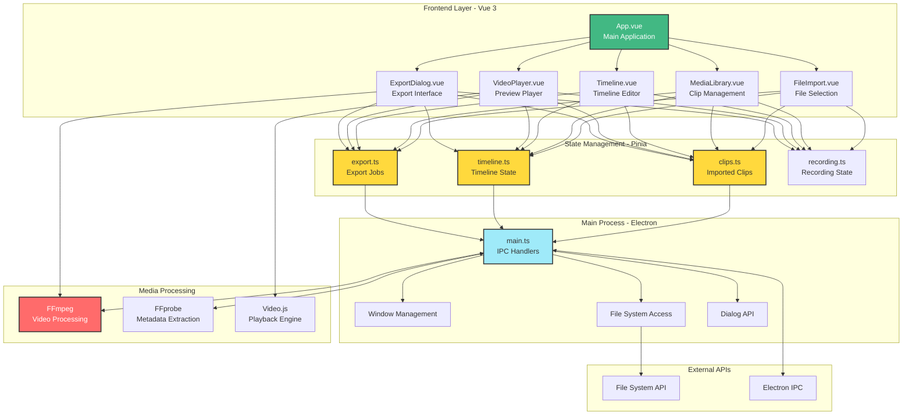

# Star-Forge

A desktop video editor built with Electron, Vue 3, and FFmpeg.

[](https://www.electronjs.org/)
[](https://vuejs.org/)
[](https://www.typescriptlang.org/)
[](LICENSE)

## Overview

Star-Forge is a lightweight desktop video editor for importing, arranging, and exporting video content. It provides essential video editing capabilities with a clean interface, powered by FFmpeg for professional-grade video processing.

## Features

### Core Capabilities

- **Multi-Format Import** - Support for MP4, MOV, WebM, AVI, and MKV video files
- **File Picker and Drag & Drop** - Import files via native file picker or intuitive drag-and-drop interface
- **Media Library** - Organized view of imported clips with metadata (duration, resolution, file size)
- **Timeline Editor** - Visual timeline for arranging and reordering clips with drag-and-drop support
- **Video Trimming** - Adjust start and end points for each clip on the timeline
- **Video Player** - Integrated preview player with Video.js for real-time playback
- **FFmpeg Integration** - Professional video processing and metadata extraction via FFprobe
- **Multi-Clip Export** - Concatenate multiple clips with automatic transitions
- **Quality Presets** - Export in 720p, 1080p, or source quality
- **Export Progress Tracking** - Real-time progress monitoring with cancellation support

### User Interface

- **Modern Design** - Built with Tailwind CSS for a clean, professional look
- **Component-Based Architecture** - Modular Vue 3 components for maintainability
- **Responsive Layout** - Optimized interface for desktop use
- **State Management** - Centralized state with Pinia stores
- **Real-Time Notifications** - Export status updates with success/error notifications

## Architecture



### Data Flow

1. **Import Flow**: `FileImport` → IPC → `FFprobe` (metadata) → `clips store` → `MediaLibrary`
2. **Timeline Flow**: `MediaLibrary` (drag) → `timeline store` → `Timeline` → `VideoPlayer`
3. **Export Flow**: `Timeline` → `ExportDialog` → `export store` → IPC → `FFmpeg` → Output File

## Getting Started

### Prerequisites

- Node.js (v18 or higher)
- npm (v9 or higher)

FFmpeg binaries are automatically bundled with the application and do not need to be installed separately.

### Installation

Clone the repository and install dependencies:

```bash
git clone https://github.com/yourusername/Star-Forge.git
cd Star-Forge
npm install
```

### Development

Start the development server:

```bash
# Option 1: Vite dev server only
npm run dev

# Option 2: Full Electron development mode (recommended)
npm run electron:dev
```

The Electron development mode launches the application with hot-reload and DevTools enabled.

## Building for Production

### Build Process

To build a distributable application for your current platform:

```bash
npm run build
```

This command will:
1. Compile the Vue 3 frontend using Vite
2. Build the Electron main process with TypeScript
3. Package the application with electron-builder
4. Output distributable files to the `release/` directory

### Build Output by Platform

#### Windows

```bash
npm run build
```

Output:
- `release/Star-Forge 1.0.0.exe` - Portable executable
- `release/win-unpacked/` - Unpacked application directory

The portable executable can be run directly without installation.

#### macOS

```bash
npm run build
```

Output:
- `release/Star-Forge-1.0.0.dmg` - Disk image installer

Note: macOS builds must be created on a Mac due to code-signing requirements. Cross-platform builds from Windows or Linux are not supported.

#### Linux

```bash
npm run build
```

Output:
- `release/Star-Forge-1.0.0.AppImage` - Portable application
- `release/Star-Forge_1.0.0_amd64.deb` - Debian package

The AppImage can be run directly after making it executable. The `.deb` package can be installed using `dpkg` or a package manager.

### Additional Build Commands

```bash
npm run build:check        # Build with TypeScript type checking before packaging
npm run electron:build     # Same as npm run build
npm run preview            # Preview production build (frontend only)
```

## Deployment

### Distribution

After building, distribute the appropriate file for your target platform:

- **Windows**: Distribute `Star-Forge 1.0.0.exe`
- **macOS**: Distribute `Star-Forge-1.0.0.dmg`
- **Linux**: Distribute `Star-Forge-1.0.0.AppImage` or `Star-Forge_1.0.0_amd64.deb`

### Code Signing (Optional)

For production releases, consider code signing:

- **Windows**: Use a code signing certificate and configure `electron-builder` with `certificateFile` and `certificatePassword`
- **macOS**: Configure Apple Developer ID and notarization in `electron-builder`
- **Linux**: AppImage and .deb packages do not require signing for distribution

Refer to the [electron-builder documentation](https://www.electron.build/code-signing) for detailed code signing instructions.

### Build Configuration

Build settings are configured in `package.json` under the `build` section:

- App ID: `com.starforge.app`
- Product Name: `Star-Forge`
- FFmpeg Binaries: Automatically included and unpacked from ASAR archive
- Output Directory: `release/`

The FFmpeg and FFprobe binaries are extracted from the ASAR package at runtime to enable video processing capabilities.

## Project Structure

```
Star-Forge/
├── electron/              # Electron main process
│   └── main.ts           # IPC handlers, window management, FFmpeg integration
├── src/
│   ├── components/       # Vue components
│   │   ├── ExportDialog.vue      # Export interface with quality settings
│   │   ├── FileImport.vue        # File selection and drag-drop
│   │   ├── MediaLibrary.vue      # Imported clips library
│   │   ├── Timeline.vue          # Timeline editor with drag support
│   │   ├── VideoPlayer.vue       # Video preview player
│   │   └── ui/                   # Reusable UI components
│   │       ├── button/           # Button component
│   │       ├── dialog/           # Dialog component
│   │       ├── input/            # Input component
│   │       ├── progress/         # Progress bar component
│   │       └── slider/           # Slider component
│   ├── stores/          # Pinia state management
│   │   ├── clips.ts             # Imported clips state
│   │   ├── export.ts            # Export job state and progress
│   │   ├── recording.ts         # Recording state (future use)
│   │   └── timeline.ts          # Timeline state and playback
│   ├── assets/          # Styles and static assets
│   │   └── index.css            # Global styles and Tailwind
│   ├── lib/             # Utility functions
│   │   └── utils.ts             # Helper utilities
│   ├── App.vue          # Root component
│   └── main.ts          # Vue app entry point
├── dist/                # Built frontend assets (generated)
├── dist-electron/       # Built Electron main process (generated)
├── release/             # Distributable packages (generated)
├── plans/               # Project documentation and planning
├── build/               # Build assets (icons, etc.)
├── package.json         # Project configuration and dependencies
├── vite.config.ts       # Vite configuration
├── tailwind.config.js   # Tailwind CSS configuration
└── tsconfig.json        # TypeScript configuration
```

## Tech Stack

| Category | Technology | Purpose |
|----------|-----------|---------|
| **Desktop Framework** | Electron 32 | Cross-platform desktop application framework |
| **Frontend** | Vue 3 + Vite + TypeScript | Reactive UI with fast hot-reload development |
| **State Management** | Pinia | Centralized, type-safe state management |
| **Styling** | Tailwind CSS | Utility-first CSS framework for rapid UI development |
| **Video Processing** | FFmpeg + FFprobe | Video encoding, decoding, and metadata extraction |
| **Video Playback** | Video.js | HTML5 video player with custom controls |
| **Build Tool** | Vite | Fast build tooling and development server |
| **Packager** | electron-builder | Create installers for Windows, macOS, and Linux |

## Usage Guide

### Importing Videos

1. Click **"Import Files"** button in the left panel
2. Select one or more video files (MP4, MOV, WebM, AVI, or MKV)
3. Or drag and drop video files directly onto the import area
4. Videos appear in the Media Library with metadata (duration, resolution, file size)

### Editing on the Timeline

1. **Add to Timeline**: Drag clips from the Media Library to the Timeline
2. **Reorder Clips**: Drag clips left or right to rearrange their sequence
3. **Trim Clips**: Use the trim handles to adjust start and end points
4. **Delete Clips**: Click the delete button (X) on any timeline clip
5. **Preview**: Use the Video Player below the timeline to preview your edit

### Exporting Your Video

1. Arrange clips on the timeline in your desired order
2. Click the **"Export"** button in the header (enabled when timeline has clips)
3. Choose output location and filename in the save dialog
4. Select quality preset:
   - **720p** - 1280x720 resolution, 2.5 Mbps bitrate
   - **1080p** - 1920x1080 resolution, 5 Mbps bitrate
   - **Source** - Original resolution, 8 Mbps bitrate
5. Click **"Start Export"** to begin rendering
6. Monitor progress in the header notification (shows percentage complete)
7. When complete, click **"Open"** to view the output file location
8. Or click the X to dismiss the notification (auto-dismisses after 5 seconds)

### Keyboard Shortcuts

- **Space** - Play/Pause preview
- **Delete** - Remove selected clip from timeline

## Available Scripts

```bash
# Development
npm run dev              # Start Vite development server
npm run electron:dev     # Run full application in development mode

# Production Build
npm run build            # Build and package application
npm run build:check      # Build with TypeScript type checking
npm run electron:build   # Build application (alias for npm run build)

# Testing
npm run preview          # Preview production build
```

## Configuration

### FFmpeg

FFmpeg and FFprobe binaries are automatically bundled through npm packages:
- `@ffmpeg-installer/ffmpeg` - Video processing
- `ffprobe-static` - Metadata extraction

The binaries are configured to be unpacked from the ASAR archive at runtime via the `asarUnpack` setting in `package.json`. No manual configuration is required.

### Environment Variables

No environment variables are required. FFmpeg paths are resolved automatically at runtime.

## Troubleshooting

### Build Issues

If the build fails, clean the project and rebuild:

```bash
# Windows (PowerShell)
Remove-Item -Recurse -Force node_modules, dist, dist-electron, release
npm install
npm run build

# macOS/Linux
rm -rf node_modules dist dist-electron release
npm install
npm run build
```

### FFmpeg Not Found

If FFmpeg errors occur:
1. Verify `asarUnpack` in `package.json` includes FFmpeg paths
2. Rebuild the application with `npm run build`

### Video Playback Issues

- Ensure video codec is H.264 for HTML5 compatibility
- Check DevTools console for errors
- Verify file path is accessible
- Re-import the file if issues persist

### Export Issues

**Progress shows 0%**: Normal during FFmpeg initialization. Progress updates appear once encoding begins.

**"Output filename matches input" error**: Choose a different output filename or location. Output cannot overwrite input files.

**Export fails**: Check console logs for detailed FFmpeg error messages.

## Contributing

Contributions are welcome. To contribute:

1. Fork the repository
2. Create a feature branch (`git checkout -b feature/feature-name`)
3. Commit your changes (`git commit -m 'Add feature'`)
4. Push to the branch (`git push origin feature/feature-name`)
5. Open a Pull Request

### Guidelines

- Follow existing code style and conventions
- Add TypeScript types for all new code
- Test on multiple platforms when possible
- Update documentation for new features

## License

This project is licensed under the MIT License. See the [LICENSE](LICENSE) file for details.

## Acknowledgments

Built with:
- Electron - Cross-platform desktop framework
- Vue.js - Reactive frontend framework
- FFmpeg - Video processing
- Tailwind CSS - UI styling
- Video.js - HTML5 video playback

## Support

For issues or questions, open an issue on [GitHub Issues](https://github.com/yourusername/Star-Forge/issues).

## Roadmap

### Version 1.0 (Current)
- Multi-format video import
- Timeline editing with drag-and-drop
- Video trimming
- Multi-clip export with concatenation
- Real-time preview
- Quality presets (720p, 1080p, source)

### Planned Features
- Screen recording
- Webcam overlay support
- Text overlays and titles
- Transitions between clips
- Audio controls
- Multiple timeline tracks
- Undo/redo functionality
- Project file save/load
- Additional export presets
- Keyboard shortcut customization
