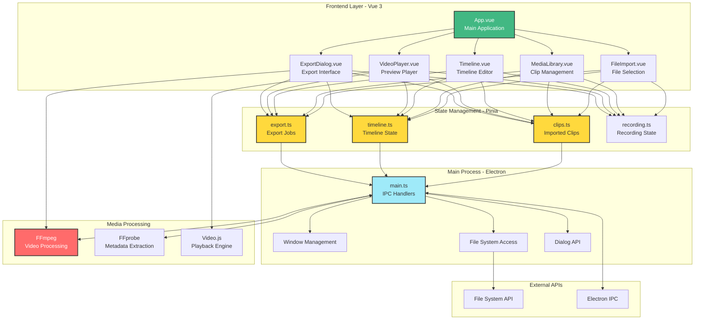

# Star-Forge

**A powerful desktop video editor built with Electron, Vue 3, and FFmpeg**

[](https://www.electronjs.org/)
[](https://vuejs.org/)
[](https://www.typescriptlang.org/)
[](LICENSE)

## Overview

Star-Forge is a lightweight, performant desktop video editor that enables users to import, arrange, and export videos with ease. Built for speed and simplicity, it provides a professional editing experience without the bloat of traditional video editing software.

## Features

### Core Capabilities

- **Multi-Format Import** - Support for MP4, MOV, WebM, AVI, and MKV video files
- **File Picker and Drag & Drop** - Import files via native file picker or intuitive drag-and-drop interface
- **Media Library** - Organized view of imported clips with metadata (duration, resolution, file size)
- **Timeline Editor** - Visual timeline for arranging and reordering clips with drag-and-drop support
- **Video Trimming** - Adjust start and end points for each clip on the timeline
- **Video Player** - Integrated preview player with Video.js for real-time playback
- **FFmpeg Integration** - Professional video processing and metadata extraction via FFprobe
- **Multi-Clip Export** - Concatenate multiple clips with automatic transitions
- **Quality Presets** - Export in 720p, 1080p, or source quality
- **Export Progress Tracking** - Real-time progress monitoring with cancellation support

### User Interface

- **Modern Design** - Built with Tailwind CSS for a clean, professional look
- **Component-Based Architecture** - Modular Vue 3 components for maintainability
- **Responsive Layout** - Optimized interface for desktop use
- **State Management** - Centralized state with Pinia stores
- **Real-Time Notifications** - Export status updates with success/error notifications

## Architecture



### Data Flow

1. **Import Flow**: `FileImport` → IPC → `FFprobe` (metadata) → `clips store` → `MediaLibrary`
2. **Timeline Flow**: `MediaLibrary` (drag) → `timeline store` → `Timeline` → `VideoPlayer`
3. **Export Flow**: `Timeline` → `ExportDialog` → `export store` → IPC → `FFmpeg` → Output File

## Getting Started

### Prerequisites

- **Node.js** (v18 or higher)
- **npm** (v9 or higher)
- **FFmpeg** (automatically bundled with the app)

### Installation

```bash
# Clone the repository
git clone https://github.com/yourusername/Star-Forge.git
cd Star-Forge

# Install dependencies
npm install
```

### Development

```bash
# Start the development server with hot-reload
npm run dev

# Or run in Electron development mode
npm run electron:dev
```

The application will launch in development mode with hot-reload enabled and DevTools open.

## Building for Production

### Quick Build

```bash
# Build for your current platform
npm run build
```

This will:
1. Build the Vue frontend with Vite
2. Compile the Electron main process with TypeScript
3. Package the application with electron-builder
4. Output distributable files to the `release/` folder

### Platform-Specific Builds

#### Windows

```bash
npm run build
# Output: release/Star-Forge Setup 1.0.0.exe (installer)
#         release/win-unpacked/ (unpacked application directory)
```

The Windows build creates an NSIS installer and an unpacked directory containing the application files.

#### macOS

```bash
npm run build
# Output: release/Star-Forge-1.0.0.dmg
```

**Note:** macOS builds can only be created on macOS due to Apple's code-signing requirements.

#### Linux

```bash
npm run build
# Output: 
# - release/Star-Forge-1.0.0.AppImage (portable application)
# - release/Star-Forge_1.0.0_amd64.deb (Debian package)
```

### Build Configuration

The build is configured in `package.json` under the `"build"` section:

- **App ID**: `com.Star-Forge.app`
- **Product Name**: Star-Forge
- **FFmpeg Binaries**: Automatically included and unpacked from ASAR for runtime access
- **Output Directory**: `release/`

### Build Scripts

```bash
npm run build              # Full build and package
npm run build:check        # Build with TypeScript type checking
npm run electron:build     # Build Electron app only (no type checking)
```

## Project Structure

```
Star-Forge/
├── electron/              # Electron main process
│   └── main.ts           # IPC handlers, window management, FFmpeg integration
├── src/
│   ├── components/       # Vue components
│   │   ├── ExportDialog.vue      # Export interface with quality settings
│   │   ├── FileImport.vue        # File selection and drag-drop
│   │   ├── MediaLibrary.vue      # Imported clips library
│   │   ├── Timeline.vue          # Timeline editor with drag support
│   │   ├── VideoPlayer.vue       # Video preview player
│   │   └── ui/                   # Reusable UI components
│   │       ├── button/           # Button component
│   │       ├── dialog/           # Dialog component
│   │       ├── input/            # Input component
│   │       ├── progress/         # Progress bar component
│   │       └── slider/           # Slider component
│   ├── stores/          # Pinia state management
│   │   ├── clips.ts             # Imported clips state
│   │   ├── export.ts            # Export job state and progress
│   │   ├── recording.ts         # Recording state (future use)
│   │   └── timeline.ts          # Timeline state and playback
│   ├── assets/          # Styles and static assets
│   │   └── index.css            # Global styles and Tailwind
│   ├── lib/             # Utility functions
│   │   └── utils.ts             # Helper utilities
│   ├── App.vue          # Root component
│   └── main.ts          # Vue app entry point
├── dist/                # Built frontend assets (generated)
├── dist-electron/       # Built Electron main process (generated)
├── release/             # Distributable packages (generated)
├── plans/               # Project documentation and planning
├── build/               # Build assets (icons, etc.)
├── package.json         # Project configuration and dependencies
├── vite.config.ts       # Vite configuration
├── tailwind.config.js   # Tailwind CSS configuration
└── tsconfig.json        # TypeScript configuration
```

## Tech Stack

| Category | Technology | Purpose |
|----------|-----------|---------|
| **Desktop Framework** | Electron 32 | Cross-platform desktop application framework |
| **Frontend** | Vue 3 + Vite + TypeScript | Reactive UI with fast hot-reload development |
| **State Management** | Pinia | Centralized, type-safe state management |
| **Styling** | Tailwind CSS | Utility-first CSS framework for rapid UI development |
| **Video Processing** | FFmpeg + FFprobe | Video encoding, decoding, and metadata extraction |
| **Video Playback** | Video.js | HTML5 video player with custom controls |
| **Build Tool** | Vite | Fast build tooling and development server |
| **Packager** | electron-builder | Create installers for Windows, macOS, and Linux |

## Usage Guide

### Importing Videos

1. Click **"Import Files"** button in the left panel
2. Select one or more video files (MP4, MOV, WebM, AVI, or MKV)
3. Or drag and drop video files directly onto the import area
4. Videos appear in the Media Library with metadata (duration, resolution, file size)

### Editing on the Timeline

1. **Add to Timeline**: Drag clips from the Media Library to the Timeline
2. **Reorder Clips**: Drag clips left or right to rearrange their sequence
3. **Trim Clips**: Use the trim handles to adjust start and end points
4. **Delete Clips**: Click the delete button (X) on any timeline clip
5. **Preview**: Use the Video Player below the timeline to preview your edit

### Exporting Your Video

1. Arrange clips on the timeline in your desired order
2. Click the **"Export"** button in the header (enabled when timeline has clips)
3. Choose output location and filename in the save dialog
4. Select quality preset:
   - **720p** - 1280x720 resolution, 2.5 Mbps bitrate
   - **1080p** - 1920x1080 resolution, 5 Mbps bitrate
   - **Source** - Original resolution, 8 Mbps bitrate
5. Click **"Start Export"** to begin rendering
6. Monitor progress in the header notification (shows percentage complete)
7. When complete, click **"Open"** to view the output file location
8. Or click the X to dismiss the notification (auto-dismisses after 5 seconds)

### Keyboard Shortcuts

- **Space** - Play/Pause preview
- **Delete** - Remove selected clip from timeline

## Development Scripts

```bash
# Development
npm run dev              # Start Vite dev server
npm run electron:dev     # Start Electron in dev mode

# Building
npm run build            # Build and package for current platform
npm run build:check      # Build with TypeScript type checking
npm run electron:build   # Build Electron app only

# Preview
npm run preview          # Preview production build
```

## Configuration

### FFmpeg Configuration

FFmpeg binaries are automatically included in the build through:
- `@ffmpeg-installer/ffmpeg` - FFmpeg binary for video processing
- `ffprobe-static` - FFprobe binary for metadata extraction

These are configured in `package.json`:
```json
"asarUnpack": [
  "node_modules/@ffmpeg-installer/**/*",
  "node_modules/ffprobe-static/**/*"
]
```

This ensures FFmpeg binaries are unpacked and accessible at runtime.

### Environment Variables

No environment variables are required for basic operation. FFmpeg paths are automatically resolved at runtime based on the installation location.

## Troubleshooting

### FFmpeg Not Found

If you see errors about FFmpeg not being found:
1. Ensure `asarUnpack` in `package.json` includes FFmpeg paths (already configured by default)
2. Rebuild the application: `npm run build`

### Build Fails

```bash
# Clean and rebuild
rm -rf node_modules dist dist-electron release
npm install
npm run build
```

On Windows (PowerShell):
```powershell
Remove-Item -Recurse -Force node_modules, dist, dist-electron, release
npm install
npm run build
```

### Video Won't Play in Preview

- Verify video codec is H.264 (most compatible with HTML5 video)
- Check browser console (DevTools) for errors
- Ensure the file path is accessible
- Try re-importing the file

### Export Progress Shows 0%

- This is normal for the first few seconds while FFmpeg initializes
- Progress updates appear once FFmpeg begins encoding
- Check console logs for detailed FFmpeg output

### Export Fails with "Output filename matches input"

- The output filename cannot be the same as any input clip
- Choose a different output filename or location
- Remove the conflicting clip from the timeline before exporting

## Contributing

Contributions are welcome! Please follow these steps:

1. Fork the repository
2. Create a feature branch (`git checkout -b feature/amazing-feature`)
3. Commit your changes (`git commit -m 'Add amazing feature'`)
4. Push to the branch (`git push origin feature/amazing-feature`)
5. Open a Pull Request

### Development Guidelines

- Follow the existing code style
- Add TypeScript types for all new code
- Test on multiple platforms when possible
- Update documentation for new features

## License

This project is licensed under the MIT License - see the [LICENSE](LICENSE) file for details.

## Acknowledgments

- **Electron** - For enabling cross-platform desktop development
- **Vue.js** - For the reactive and intuitive frontend framework
- **FFmpeg** - For powerful video processing capabilities
- **Tailwind CSS** - For rapid UI development with utility classes
- **Video.js** - For robust HTML5 video playback

## Support

For issues, questions, or suggestions:
- Open an issue on [GitHub Issues](https://github.com/yourusername/Star-Forge/issues)
- Check existing documentation in this README

## Roadmap

### Current Features (v1.0)
- Multi-format video import
- Timeline editing with drag-and-drop
- Video trimming
- Multi-clip export with concatenation
- Real-time preview
- Quality presets (720p, 1080p, source)

### Planned Features
- Screen recording with desktop capturer
- Webcam overlay support
- Text overlays and titles
- Transitions (fade, slide, dissolve)
- Audio controls (volume, fade in/out)
- Multiple timeline tracks
- Undo/redo functionality
- Auto-save and project files
- Export presets (YouTube, TikTok, Instagram)
- Keyboard shortcut customization

---

**Made with Vue, Electron, and FFmpeg**

[Report Bug](https://github.com/yourusername/Star-Forge/issues) · [Request Feature](https://github.com/yourusername/Star-Forge/issues) · [Documentation](https://github.com/yourusername/Star-Forge/wiki)
